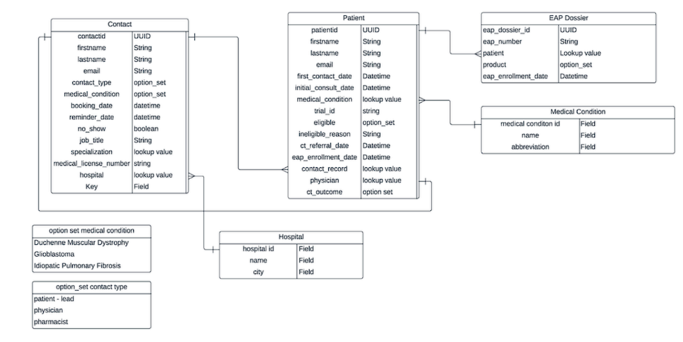
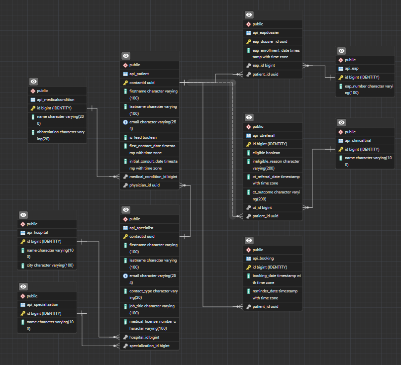

**myTomorrows - Tech Interview BE Case**

# Deployment

The folder `backend` contains Dockerfile that needs to be build and run. I added CloudFormation template `serverless.yml`, but I have no account on AWS to test it. Just based on my old knowledge looks legit enough, but who knows if it is actually working :)

# Challenge
Welcome to the myTomorrows take-home assignment!

## Part 1: Data modelling

### **Introduction:**

The company uses a Customer Relations Management (CRM) system as its main data source. All business processes run within this CRM
and the whole company uses it pretty heavily. Now you slowly want to go to a better transactional database design which includes a self
managed database on the cloud to be able to create portals (internal UI’s that connect to the data source) outside of the CRM system. The
design of the tables in the CRM however is created by some non-technical people which has led to certain limitations in the data structure
which the company needs to overcome.

### **The (current) business / the flow**

At my tomorrows we help patients on a daily basis. These patients can come in through multiple channels all captured within this CRM system. A patient comes through a contact form or a special landing page which has a form to fill in (and is considered a lead in this stage). This would create a Contact record where the medical_condition is an important field.

The patient(lead) books a call on the second step on the form which would enter the booking date field. When a patient navigator (PN) has the call with the patient(lead) it will consider wether this patient is a valuable lead and converts the `Contact` record into a `Patient` record. From this point there are two records a `Contact` and a `Patient` record. Both records are linked and share some data points but not all of them.

The `medical_condition` field lives in both entities/tables but have a different meaning. One is an `option_set` (static fixed data, like an `ENUM` but that has its own table and FK) while the other is a `lookup` table (dynamic linked table that can grow) which is giving many issues when converting a contact to a patient.

A patient can follow the rest of the flow after conversion which means it can follow a clinical trial (CT) referral or an Expanded Access Program (EAP) referral.

A patient always requires a physician his support to follow through the flow. The physician is linked on the Patient record and a physician is a Contact record and can be linked to a hospital he or she works at. The difference between a `Contact` - physician and a `Contact` - patient(lead) is certain fields like hospital but also the `contact_type`.

## Answers to Questions

**Considering the following diagram:**

**Requirements**

- After conversion, the `Contact` and `Patient` record are both used in different systems, they have to be kept in sync. Updating both `Patient` and `Contact` record is sometimes tedious to do, it would be better to normalize the database.
- A patient must be able to be referred to multiple EAP and CT journeys
- The medical condition is confusing (`option_set` vs `lookup`) would be better to consolidate.
- `Contact` record (and its fields) can be confusing holding multiple user types.
- A patient can have multiple calls with a PN, but the data must not be lost for each booking/call.
- A returning patient might enter his details on a landing page a second time, data must not be lost/overwritten.

---

### **Question 1.1**: How would you redesign the above data model to make more sense with a more linear flow?

I would use `Contact` as abstract model and create separate `Patient` and `Specialist` models with fields that are related to each model. Patient will have field `is_lead` that will separate valid patients from just users that filled form on a landing page. `Email` will be unique, so it won't be possible to create new record with same email twice. Remove `medical_condition` that is using `ENUM` values, only lookup. Add separate `Booking` model. Create a many-to-many relationship between `EAP` - `Patient` using `EAPDossier` as table in between. Similar to `CT` - `Pateint` with `CTReferral` table.

### **Question 1.2**: Describe the steps that you would take to migrate or evolve from the data model mentioned in the assignment versus the newly designed model?

Data mapping between existing table and new one and than populate new tables.

## Part 2: Coding thought process

Create an API that can work on an **AWS lambda resource with an API Gateway resource in front**. You can use one of the models you have created or an existing one from the provided model.

For the created model, create all CRUD operations / endpoints.

The following points are optional but will give you bonus points:
- SAM/Serverless deployment
- Docker image instead of zip file
- Working IaC template
- Framework (Fastapi, Flask, Django etc)
- Unit test (tests must work in every local development setting / offline)

### About solution

I used `Django` - just beacuse I find ORM in that framework much easier to work with, just so I can finish the task faster. `PostgreSQL` as database might be an overkill for this task, but I use it by default.

For my local setup I used `devcontainer`. Helps to setup env quickly and clean. No need to worry about `venv`. Open VS Code, Reopen in Container, after couple of minutes everything is setup. Simply use `Backend` launch configurations to start working with together debugging tool help. There are some unit tests, but nothing fancy.
